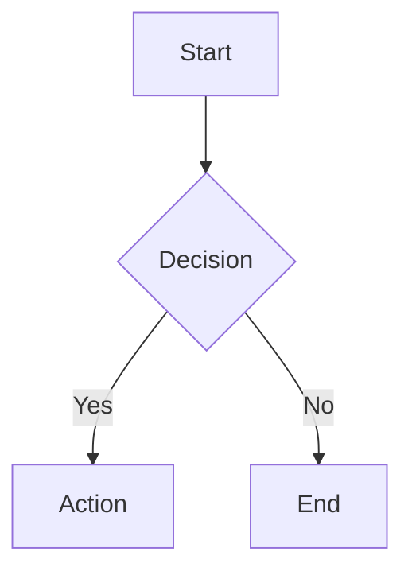

# ASCII Diagram to PNG / PPTX

ASCII 다이어그램과 Mermaid 다이어그램을 PNG 이미지 또는 PowerPoint(PPTX) 파일로 변환하는 Python 데스크톱 애플리케이션입니다.


---

## 기능

- **Tkinter GUI** — 다이어그램을 붙여넣고 버튼 하나로 변환합니다.
- **ASCII 다이어그램 렌더링** — 네 가지 레이아웃 자동 감지:
  - 수직 흐름 (`|` / `v` 연결자)
  - 이중 컬럼 흐름 (공백으로 구분된 나란히 배치)
  - 타임라인 (`08:20`, `Later`, `Soon` 등 시간 토큰으로 시작하는 줄)
  - 루트 분기 (`+-->` 스타일)
- **Mermaid 다이어그램 렌더링** — `flowchart`, `graph`, `sequenceDiagram`, `classDiagram`, `stateDiagram`, `erDiagram`, `gantt`, `pie`, `gitGraph`, `mindmap`, `timeline` 등 지원.
- **PNG 내보내기** — 타임스탬프로 자동 저장되는 고품질 래스터 이미지.
- **PPTX 내보내기** — flowchart는 PowerPoint 네이티브 도형으로, 나머지 유형은 이미지로 삽입.
- **마크다운 펜스 자동 제거** — 삼중 백틱(` ``` `)으로 감싼 내용도 바로 렌더링 가능.
- **한글 폰트 지원** — Windows에서 맑은 고딕 사용, 없으면 시스템 폰트로 자동 대체.
- **오프라인 + 온라인 Mermaid** — 로컬 `mmdc` CLI 우선, 없으면 `mermaid.ink` API로 대체.

---

## 요구 사항

| 패키지 | 버전 |
|---|---|
| Python | 3.9 이상 |
| Pillow | >= 10.0.0 |
| python-pptx | >= 0.6.21 |
| tkinter | Python 기본 포함 |

> **Linux:** tkinter가 별도 패키지로 분리된 배포판이 있습니다.
> ```sh
> sudo apt install python3-tk    # Debian / Ubuntu
> sudo dnf install python3-tkinter  # Fedora
> ```

> **선택:** Node.js + `@mermaid-js/mermaid-cli` (`mmdc`)를 설치하면 오프라인으로 고품질 Mermaid 렌더링이 가능합니다.

---

## 설치

### Windows (명령 프롬프트)

```bat
install.bat
```

### Windows (PowerShell)

```powershell
.\install.ps1
```

### macOS / Linux

```sh
chmod +x install.sh
./install.sh
```

위 스크립트는 `venv/` 가상 환경을 생성하고 `requirements.txt`의 의존성을 설치합니다.

---

## 실행

### Windows (명령 프롬프트)

```bat
run.bat
```

### Windows (PowerShell)

```powershell
.\run.ps1
```

### macOS / Linux

```sh
chmod +x run.sh
./run.sh
```

### 직접 실행 (venv 없이)

```sh
pip install -r requirements.txt
python app.py
```

---

## 사용 방법

1. 텍스트 영역에 ASCII 또는 Mermaid 다이어그램을 **붙여넣습니다** (마크다운 펜스 포함 가능).
2. **Generate PNG** 버튼으로 PNG를, **Generate PPTX** 버튼으로 PowerPoint 파일을 내보냅니다.
3. **Open Output Folder** 버튼으로 `outputs/` 폴더를 엽니다.

출력 파일명 형식: `YYYYMMDD_HHMMSS.png` / `.pptx`

---

## 지원하는 ASCII 다이어그램 스타일

### 수직 흐름

```
Load task cards
      |
      v
Add part requirements
      |
      v
Calculate expected use by station and part
```

### 수직 흐름 + 측면 분기

```
Add linked issue quantity
      |
      +--> keep orphan issue rows separate
      |
      v
Add latest cycle count
```

### 이중 컬럼 흐름

```
Physical world                    Record world
--------------                    ------------
12 seal rings in bin              12 seal rings in system

Technician uses 1 ring            No issue posted yet
```

### 루트 분기

```
Investigation queue row
        |
        +--> Materials review
        |      - recount the bin
        |      - review issue and receipt history
        |
        +--> Maintenance review
               - confirm actual part use for the task IDs
```

### 타임라인

```
08:20   Task opens
09:50   Seal replacement task closes
10:00   Aircraft is released back to service
```

---

## Mermaid 다이어그램 예시

````

````

마크다운 코드 펜스는 렌더링 전 자동으로 제거됩니다.

---

## 프로젝트 구조

```
diagram_ascii2png/
+-- app.py                       Tkinter GUI 진입점
+-- requirements.txt
+-- install.bat / install.ps1 / install.sh
+-- run.bat / run.ps1 / run.sh
+-- outputs/                     생성된 파일 저장 (자동 생성)
+-- diagram_renderer/
    +-- __init__.py
    +-- parser.py                ASCII 텍스트 -> DiagramModel
    +-- layout.py                DiagramModel -> Layout (박스, 화살표)
    +-- renderer.py              Layout -> PIL Image / PNG
    +-- pptx_exporter.py         Layout -> PowerPoint (python-pptx)
    +-- mermaid_layout.py        Mermaid 구문 -> Layout 모델
    +-- mermaid_renderer.py      Mermaid PNG / PPTX 렌더러
    +-- style.py                 색상 팔레트 및 레이아웃 상수
    +-- font.py                  폰트 로딩 (폴백 포함)
```

---

## 알려진 제한 사항

- ASCII 파서는 휴리스틱 기반입니다. 매우 복잡하거나 비표준적인 박스 드로잉은 완벽하게 렌더링되지 않을 수 있습니다.
- `flowchart`/`graph` 외의 Mermaid 다이어그램은 네이티브 도형 대신 PNG로 렌더링되어 PPTX에 삽입됩니다.

---

## 라이선스

MIT

---

---

# ASCII Diagram to PNG / PPTX (English)

A Python desktop application that converts ASCII diagrams and Mermaid diagrams into polished PNG images or PowerPoint (PPTX) files.

---

## Features

- **Tkinter GUI** — paste a diagram, click a button, done.
- **ASCII diagram rendering** — automatic detection of four layout styles:
  - Vertical flow (`|` / `v` connectors)
  - Two-column flow (side-by-side columns separated by spaces)
  - Timeline (lines starting with time tokens such as `08:20`, `Later`, `Soon`)
  - Branch from root (`+-->` style)
- **Mermaid diagram rendering** — supports `flowchart`, `graph`, `sequenceDiagram`, `classDiagram`, `stateDiagram`, `erDiagram`, `gantt`, `pie`, `gitGraph`, `mindmap`, `timeline`, and more.
- **PNG export** — high-quality rasterised output, timestamped automatically.
- **PPTX export** — native PowerPoint shapes for flowcharts; other types embedded as images.
- **Markdown fence stripping** — triple-backtick fences are stripped before rendering.
- **Korean font support** — uses Malgun Gothic on Windows with graceful fallback.
- **Offline + online Mermaid** — uses local `mmdc` CLI when available, falls back to the `mermaid.ink` API.

---

## Requirements

| Package | Version |
|---|---|
| Python | 3.9 or later |
| Pillow | >= 10.0.0 |
| python-pptx | >= 0.6.21 |
| tkinter | bundled with Python |

> **Linux:** tkinter may need a separate package.
> ```sh
> sudo apt install python3-tk    # Debian / Ubuntu
> sudo dnf install python3-tkinter  # Fedora
> ```

> **Optional:** Install Node.js and `@mermaid-js/mermaid-cli` (`mmdc`) for offline, high-quality Mermaid rendering.

---

## Installation

### Windows (Command Prompt)

```bat
install.bat
```

### Windows (PowerShell)

```powershell
.\install.ps1
```

### macOS / Linux

```sh
chmod +x install.sh
./install.sh
```

These scripts create a virtual environment in `venv/` and install all dependencies from `requirements.txt`.

---

## Running

### Windows (Command Prompt)

```bat
run.bat
```

### Windows (PowerShell)

```powershell
.\run.ps1
```

### macOS / Linux

```sh
chmod +x run.sh
./run.sh
```

### Manual (without venv)

```sh
pip install -r requirements.txt
python app.py
```

---

## How to Use

1. **Paste** your ASCII or Mermaid diagram into the text area (Markdown fences are fine).
2. Click **Generate PNG** to export a PNG, or **Generate PPTX** to export a PowerPoint file.
3. Click **Open Output Folder** to open the `outputs/` directory.

Output files are named by timestamp: `YYYYMMDD_HHMMSS.png` / `.pptx`.

---

## Supported ASCII Diagram Styles

### Vertical Flow

```
Load task cards
      |
      v
Add part requirements
      |
      v
Calculate expected use by station and part
```

### Vertical Flow with Side Branch

```
Add linked issue quantity
      |
      +--> keep orphan issue rows separate
      |
      v
Add latest cycle count
```

### Two-Column Flow

```
Physical world                    Record world
--------------                    ------------
12 seal rings in bin              12 seal rings in system

Technician uses 1 ring            No issue posted yet
```

### Branch from Root

```
Investigation queue row
        |
        +--> Materials review
        |      - recount the bin
        |      - review issue and receipt history
        |
        +--> Maintenance review
               - confirm actual part use for the task IDs
```

### Timeline

```
08:20   Task opens
09:50   Seal replacement task closes
10:00   Aircraft is released back to service
```

---

## Mermaid Diagram Example

````

````

The Markdown code fence is stripped automatically before rendering.

---

## Project Structure

```
diagram_ascii2png/
+-- app.py                       Tkinter GUI entry point
+-- requirements.txt
+-- install.bat / install.ps1 / install.sh
+-- run.bat / run.ps1 / run.sh
+-- outputs/                     Generated files (auto-created)
+-- diagram_renderer/
    +-- __init__.py
    +-- parser.py                ASCII text -> DiagramModel
    +-- layout.py                DiagramModel -> Layout (boxes, arrows)
    +-- renderer.py              Layout -> PIL Image / PNG
    +-- pptx_exporter.py         Layout -> PowerPoint (python-pptx)
    +-- mermaid_layout.py        Mermaid syntax -> Layout model
    +-- mermaid_renderer.py      Mermaid PNG / PPTX renderer
    +-- style.py                 Color palette and layout constants
    +-- font.py                  Font loading with fallback
```

---

## Known Limitations

- The ASCII parser is heuristic-based; highly complex or non-standard box drawings may not render perfectly.
- Mermaid diagrams other than `flowchart`/`graph` are rendered as PNG and embedded in PPTX rather than converted to native shapes.

---

## License

MIT
